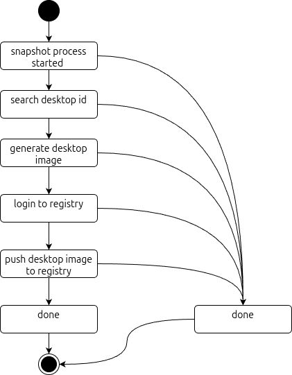

# oc.snapshot

**oc.snapshot** is a powerful sidecar for **oc.user**, enabling the capture and preservation of the user environment's state at any given moment. 

- By leveraging this functionality, users can create detailed snapshots of their entire environment, including configurations, data, and active processes, ensuring a consistent and reliable record of their system's condition. 

- This capability is particularly valuable for troubleshooting, system audits, or rapid recovery in case of errors, as it allows teams to revert to a stable state or analyze past configurations without manual intervention. 

With **oc.snapshot**, the user environment becomes not only more manageable but also more resilient, offering a robust solution for maintaining data integrity and operational continuity.

## API

The **Nerdctl Snapshot API** allows clients to:

* Check the current API version
* Trigger a snapshot of the current container state
* Monitor the status of a snapshot using a session ID
* Access the OpenAPI documentation dynamically

This API is intended to interact with a container runtime (`nerdctl`) to automate snapshot and image push workflows.

The API is accessible at http://<sidecar_ip>:29785. Below are some of the available endpoints and their functionalities:

```
http://localhost:5000
```

### Common Response Format

All endpoints return a consistent JSON structure:

```json
{
  "message": "string",
  "status": "success | error",
  "timestamp": "ISO 8601 timestamp",
  "session_id": "string",
  "api_version": "string"
}
```

### Endpoints

#### `GET /version`

##### 🔹 Description

Returns the current API version.

##### 🔹 Response Example

```json
{
  "message": "version is 1.0.0",
  "status": "success",
  "timestamp": "2025-07-13T15:21:55.891Z",
  "session_id": "none",
  "api_version": "1.0.0"
}
```

#### `POST /snapshot`

##### 🔹 Description

Triggers a system snapshot by:

1. Identifying the container
2. Creating a container image
3. Logging into a registry
4. Pushing the image to the registry

##### 🔹 Response Example

```json
{
  "message": "image pushed to registry",
  "status": "success",
  "timestamp": "2025-07-13T15:23:12.123Z",
  "session_id": "1720947792123123123",
  "api_version": "1.0.0"
}
```

##### Notes

* A unique `session_id` is generated for tracking the snapshot process.
* Use this `session_id` with the `/snapshot/{session_id}` endpoint to monitor progress.

#### `GET /snapshot/{session_id}`

##### 🔹 Description

Returns the current status of a snapshot session.

##### 🔹 Path Parameters

| Name         | Type   | Description             |
| ------------ | ------ | ----------------------- |
| `session_id` | string | The session ID to track |

##### 🔹 Successful Response

```json
{
  "message": "done",
  "status": "success",
  "timestamp": "2025-07-13T15:23:22.001Z",
  "session_id": "1720947792123123123",
  "api_version": "1.0.0"
}
```

##### Error Response (Unknown Session)

```json
{
  "message": "unknown session",
  "status": "error",
  "timestamp": "2025-07-13T15:24:00.000Z",
  "session_id": "invalid_session_id",
  "api_version": "1.0.0"
}
```

##### snapshot steps



#### `GET /snapshots`

##### 🔹 Description

Retrieves the list of snapshot sessions and their status for the current user. The user is determined internally (e.g., via a constant like `ABCDESKTOP_USERID`).

##### 🔹 Successful Response

```json
{
  "message": [
    {
      "session_id": "abc123",
      "status": "done"
    },
    {
      "session_id": "xyz789",
      "status": "done"
    }
  ],
  "status": "success",
  "timestamp": "2025-07-13T15:21:34.123456",
  "session_id": "none",
  "api_version": "v1.0.0"
}
```

##### Error Response (Unknown Session)

```json
{
  "message": "unknown session",
  "status": "error",
  "timestamp": "2025-07-13T15:24:00.000Z",
  "session_id": "invalid_session_id",
  "api_version": "1.0.0"
}
```

#### `GET /swagger`

or

#### `GET /swagger.json`

##### 🔹 Description

Returns the full OpenAPI (Swagger) specification for this API.

##### 🔹 Response

Returns the YAML or JSON specification used for Swagger UI, Redoc, etc.

### Error Handling

If an unknown endpoint is called, the API will return:

```json
{
  "message": "unsupported page",
  "status": "error",
  "timestamp": "2025-07-13T15:25:00.000Z",
  "session_id": "none",
  "api_version": "1.0.0"
}
```

